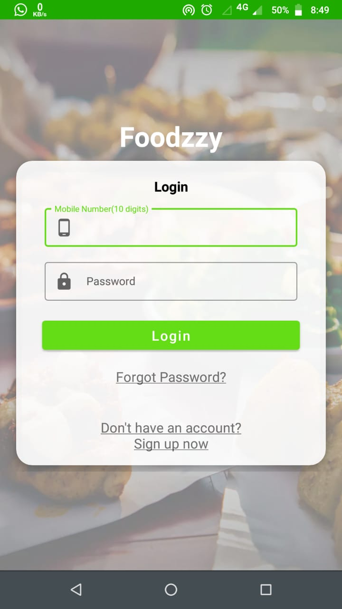
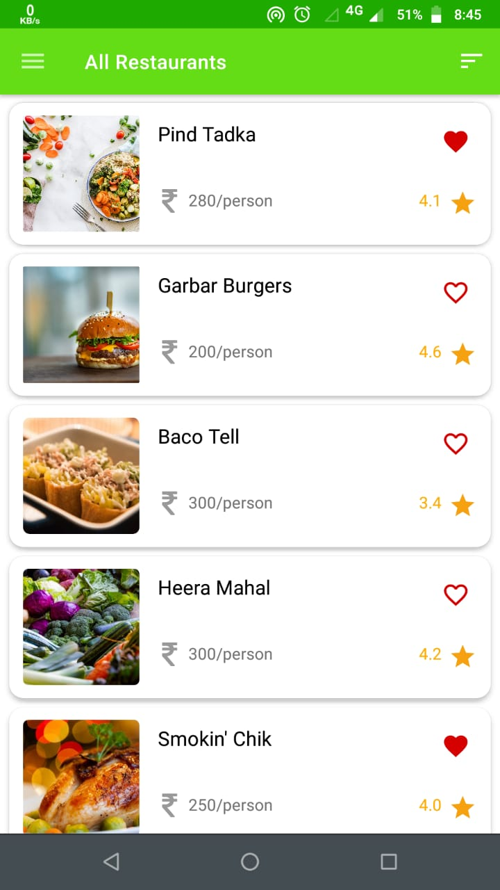
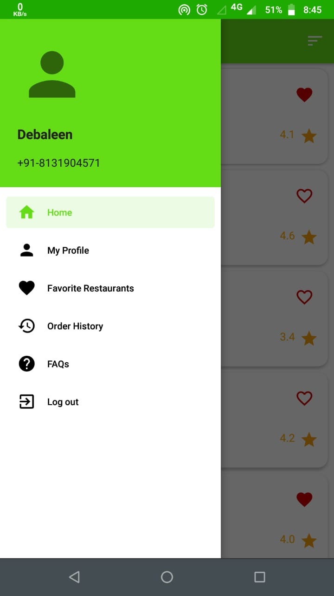
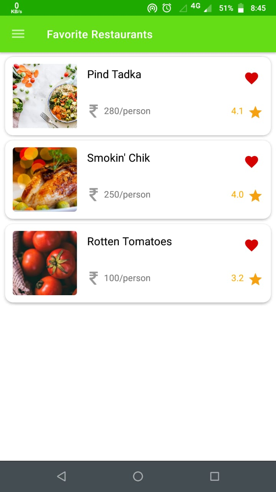
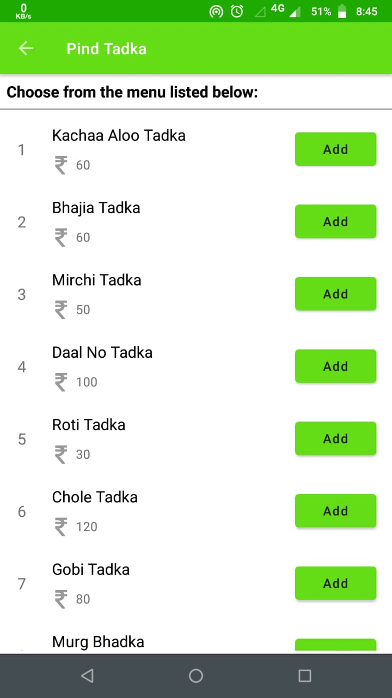
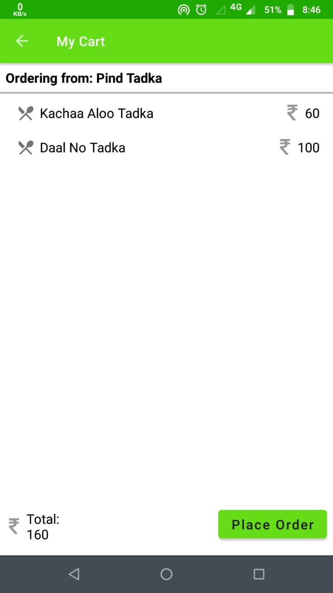
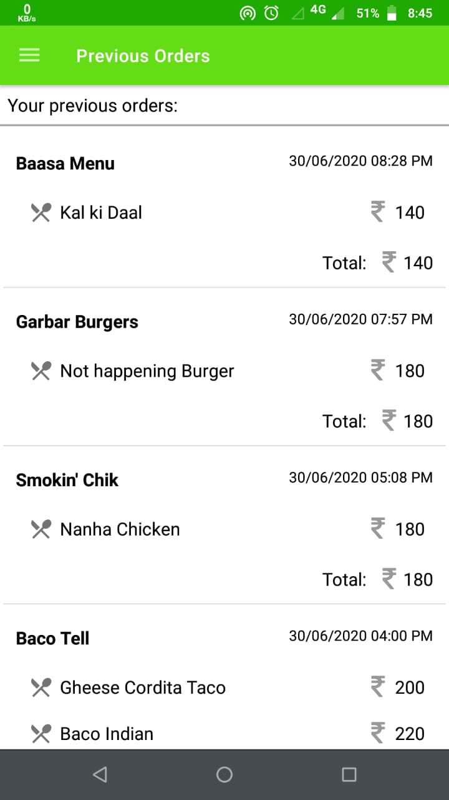

<p align="center">
  
</p>

# Foodzzy

[](LICENSE)


**Foodzzy** is a simple Android application 📱 for online food ordering. It is my solution of the project task for the [Internshala Training on Android App Development](https://trainings.internshala.com/android-training).


<table style="width:100%">
  <tr>
    <th>Splash Screen</th>
    <th>Login Screen</th>
    <th>Home Screen</th>
    <th>Navigation Drawer</th>
    <th>Favourites Screen</th>
    <th>Menu Screen</th>
    <th>Cart Screen</th>
    <th>Previous Orders</th>
    <th>FAQ Screen</th>
  </tr>
  <tr>
    <td></td>
    <td></td>
    <td></td>
    <td></td>
    <td></td>
    <td></td>
    <td></td>
    <td></td>
    <td></td>
  </tr>
</table>

## About
- It is a demo food ordering app for Android. It connects with the server by the help of an API. 
- This project is required for the partial fulfilment of the  [training curriculum](https://trainings.internshala.com/android-training) provided by [Internshala](https://internshala.com/).
- This project covers all the topics taught in the training.
- This project doesn't use MVVM, MVC or MVP architecture as these were outside the scope of the training.


## Built With 🛠
- [Kotlin](https://kotlinlang.org/) - First class and official programming language for Android development.
- [Volley](https://developer.android.com/training/volley) - Volley is an HTTP library that makes networking for Android apps easier and most importantly, faster.
- [Picasso](https://square.github.io/picasso/) - A powerful image downloading and caching library for Android.
- [Picasso Transformations](https://github.com/wasabeef/picasso-transformations) - An Android transformation library providing a variety of image transformations for Picasso.
- [Room Persistence Library](https://developer.android.com/topic/libraries/architecture/room) - The Room persistence library provides an abstraction layer over SQLite to allow for more robust database access while harnessing the full power of SQLite.
- [Gson](https://github.com/google/gson) - Gson is a Java library that can be used to convert Java Objects into their JSON representation and vice-versa.
- [Material Components for Android](https://github.com/material-components/material-components-android) - Modular and customizable Material Design UI components for Android

# Package Structure
    
    dev.debaleen.foodrunner       # Root Package
    .
    ├── activity                  # Activity Classes
    ├── adapter                   # Adapters for Recycler Views
    ├── database                  # Database classes for storing Favourite Restaurants locally.
    ├── fragment                  # Fragment classes
    ├── model                     # Supporting data classes
    ├── network                   # Network classes for communication with server via API.
    └── util                      # Utility functions and constants.


## Credits
Thanks to 
- [Internshala](https://internshala.com/) for this training.


## License
```
MIT License

Copyright (c) 2020 Debaleen Das Spandan

Permission is hereby granted, free of charge, to any person obtaining a copy
of this software and associated documentation files (the "Software"), to deal
in the Software without restriction, including without limitation the rights
to use, copy, modify, merge, publish, distribute, sublicense, and/or sell
copies of the Software, and to permit persons to whom the Software is
furnished to do so, subject to the following conditions:

The above copyright notice and this permission notice shall be included in all
copies or substantial portions of the Software.

THE SOFTWARE IS PROVIDED "AS IS", WITHOUT WARRANTY OF ANY KIND, EXPRESS OR
IMPLIED, INCLUDING BUT NOT LIMITED TO THE WARRANTIES OF MERCHANTABILITY,
FITNESS FOR A PARTICULAR PURPOSE AND NONINFRINGEMENT. IN NO EVENT SHALL THE
AUTHORS OR COPYRIGHT HOLDERS BE LIABLE FOR ANY CLAIM, DAMAGES OR OTHER
LIABILITY, WHETHER IN AN ACTION OF CONTRACT, TORT OR OTHERWISE, ARISING FROM,
OUT OF OR IN CONNECTION WITH THE SOFTWARE OR THE USE OR OTHER DEALINGS IN THE
SOFTWARE.
```
